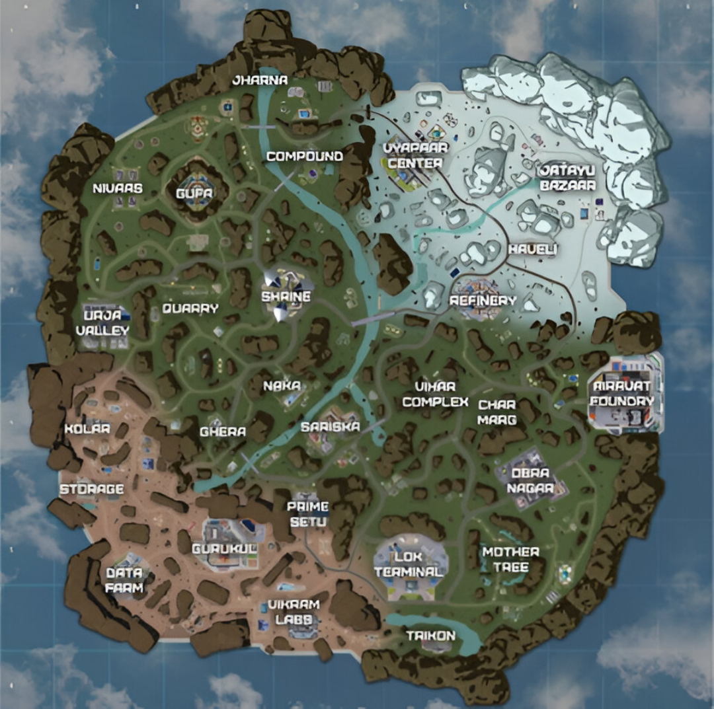

# 🎮 Scrim Discord Bot


A complete competitive scrim management system built using Discord.js v14, MongoDB, and Canvas.

Designed for competitive Discord communities that require structured team enrollment, automated scrim slot tracking, drop location locking, and dynamic match visualization.

---

## 🚀 Core Features

### 🏆 Team Enrollment System

* Private enrollment channels
* Multi step modal workflow
* Team name and tag validation
* Player validation using Discord IDs
* Duplicate team prevention
* Leadership transfer system
* Auto cleanup of invalid members
* 10 minute session timeout protection

### 🎯 Scrim Registration System

* Multiple time slots
* Drop location locking
* Duplicate registration protection
* Real time slot tracking
* Scrim status overview
* Unregister system

### 🗺 Map Rendering Engine

* Dynamic Canvas map drawing
* Drop location markers
* Team names rendered on map
* Auto updated map on new registration

### 📊 Logging & Admin Tools

* Scrim registration logs
* Scrim unregister logs
* Team enrollment logs
* Admin data wipe commands
* Public activity logs

---

## 📸 Screenshots

Place your screenshots inside:

```
src/assets/
```

Then add:

```

```

You can also add screenshots of:

* Enrollment channel
* Modal form
* Scrim status embed

---

## ⚙️ Installation

### 1. Clone Repository

```
git clone https://github.com/nexcoder-dev/Scrim-Discord-Bot.git
cd Scrim-Discord-Bot
```

### 2. Install Dependencies

```
npm install
```

### 3. Configure config.json

Fill in:

* Bot token
* MongoDB connection string
* Logging channel IDs
* Admin IDs

### 4. Start Bot

```
node src/index.js
```

---

## 🧪 Command Usage Examples

### Create Team Panel

```
/panel channel:#scrim-panel
```

### Register for Scrim

```
/scrim-register time:18:00 location:COMPOUND
```

### View Scrim Status

```
/scrim-status
```

### View Slot List

```
/slotlist
```

### Unregister

```
/scrim-unregister
```

### Admin Data Delete

```
/delete-data team
/delete-data scrim
```

---

## 🛠 Tech Stack

* Node.js 18+
* Discord.js v14
* MongoDB
* Mongoose
* Canvas

---

## ⚖️ License & Usage Terms

This project is protected under a Custom Commercial and Attribution License.

### Allowed:

* Personal use
* Educational use
* Portfolio use with mandatory credit to Sayan

### Not Allowed Without Written Agreement:

* Selling this software
* Hosting for paying clients
* Using in monetized Discord servers
* Including in paid products

If commercial use is approved:

50 percent of all gross revenue generated must be paid to the original author.

See LICENSE file for full details.

---

## 🤝 Contributing

This is not an open source project.

Contributions are accepted under the condition that:

* All ownership remains with the author
* Contributors gain no redistribution rights

Read CONTRIBUTING.md before submitting a pull request.

---

## 👨‍💻 Author

Sayan
Backend Developer

For commercial licensing inquiries:
gsa339402@gmai.com